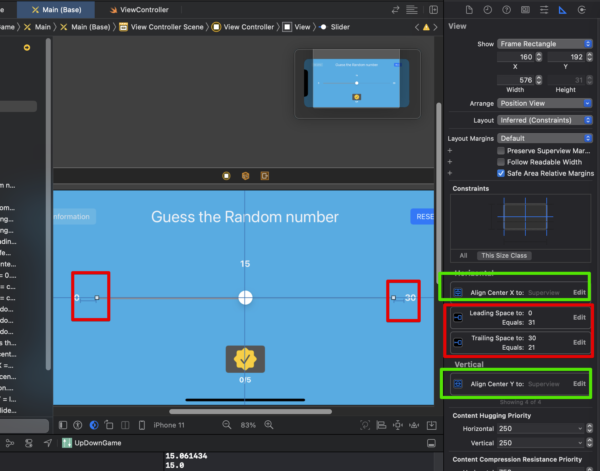

# Auto Layout

## 정의

- 애플의 대부분의 플랫폼에서 통용되는 레이아웃 엔진
- 렌더링하기 위해 사용되는 기술
- `제약을 통해서 view를 컨트롤하게 됨`

## 기본 오토 레이아웃 작동 방식

## Auto layout의 필요성

- 서로 다른 화면크기를 가젼 기기들 사이에서도 UI가 잘 배치되도록 하기 위함
- 화면 비율을 기기별로 모두 설정하지 않아도 가능하게 함
- 화면이 가로로 누워도, 적절한 배치 유지 가능하게 함
- `View 요소에 직접 적용하는 방식`

## 수정 방법

- 다음의 두가지를 이용
- 과정

  1. 오토레이아웃으로 기본 위치 잡아줌
  2. 위처럼 하면 View 요소에 다른 방향으로 빨간 실선이 오토레이아웃 메뉴에 나타나고, view 영역에서는 빨간색 실선이 나타난다
  3. 예시로, 위를 constraint를 잡아준 경우, 좌/우가 맞지 않기 때문에, 이부분을 수정해야함
  4. Horizontally in Container 메뉴 사용
      

- 설명

  1. 레이아웃 기본 설정
       
     
  2. 수정
     - constraint 설정 이후, 움직인 경우 실행상태(규제를 걸어놓은 대로 돌아가려면) 다음의 버튼 클릭
       
     - 재수정을 하고 싶을 때
       - (같은 constraint를 여러개 만들지 말고, 존재하던 constraint를 수정하는 방식이 맞음)
       - 다음의 탭에서 수정함; 삭제, 수정 등을 모두 할 수 있음
         
  3. 3요소 등을 한번에 정렬하고 싶을 때
     - 다음을 사용
       
  4. 주의
     - 다음의 두 가지가 구분되어야 함; 요소들 끼리 정렬 / 컨터에너 안에서의 정렬의 2가지가 있음
       
     - 슬라이더 혹은 다른 asset의 경우에도, 모든 constraint를 맞춰주어야 제대로 동작할 수 있음!!
       
