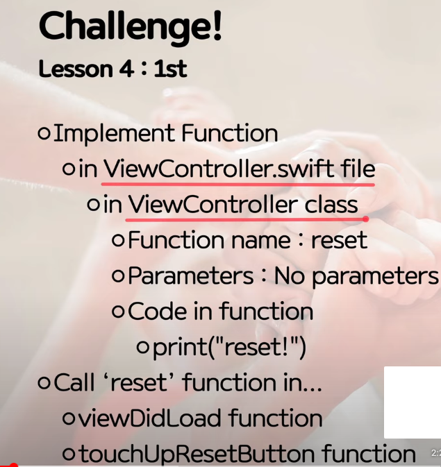

# Coding - 함수

## 정의

- 특정한 하나의 역할을 수행하는 기능들의 instruction
- Swift로 app 개발시, action의 기능을 수행하는 등으로 이해할 수 있음

<br>

## 예시

```swift
class ViewController: UIViewController {


    /*
    Storyboard와 연결해주는 어노테이션 -> slider & button은 다른 sender이라 button은
    Code와 Storyboard의 연결이 필요
    */
    @IBOutlet weak var slider: UISlider!


    override func viewDidLoad() {
        super.viewDidLoad()
        // Do any additional setup after loading the view.

        slider.setThumbImage(UIImage(imageLiteralResourceName: "slider_thumb"), for: .normal)
    }

    @IBAction
    func touchUpResetButton(_ sender: UIButton){
        slider.value = 15
        print(slider.value)
    }

    @IBAction
    func sliderValueChanged(_ sender: UISlider){
        print(sender.value)
    }

    @IBAction
    func touchUpHitButton(_ sender: UIButton){
        print(slider.value)
    }

}
```

- func : 함수 선언
- sliderValueChanged : 함수 이름
- @IBAction : 이벤트 연결, 이벤트 driven 방식에서 특정 동작에 연결시키기 위함 -> 인터페이스 빌더에서 연결시킴
- 메서드 : Class 안에 들어있는 함수들
- 함수는 1급 변수 취급

<br>

## Challenge!


