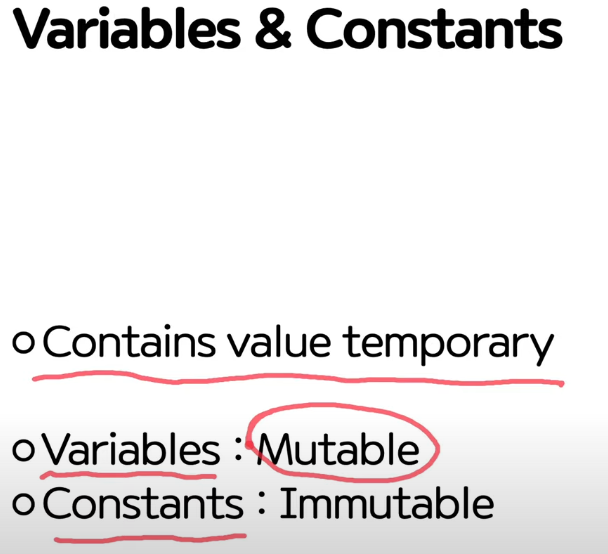
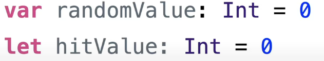
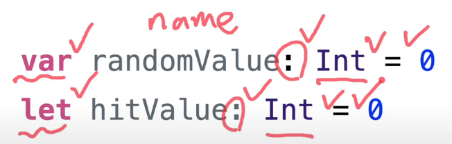
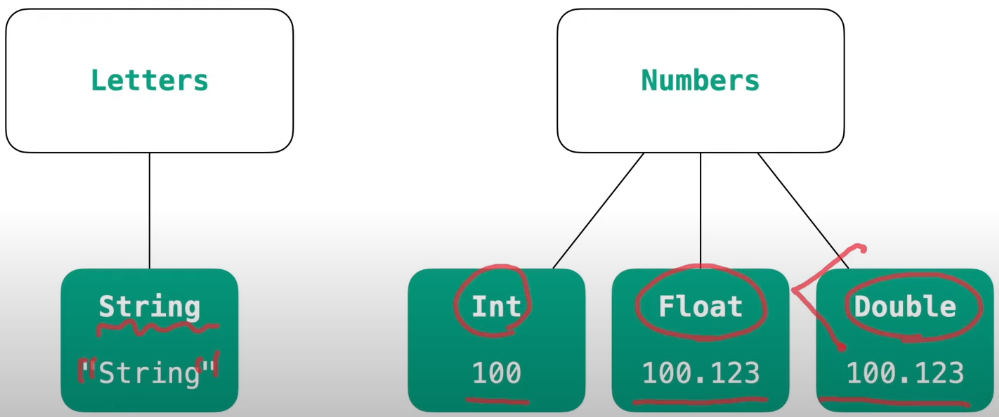
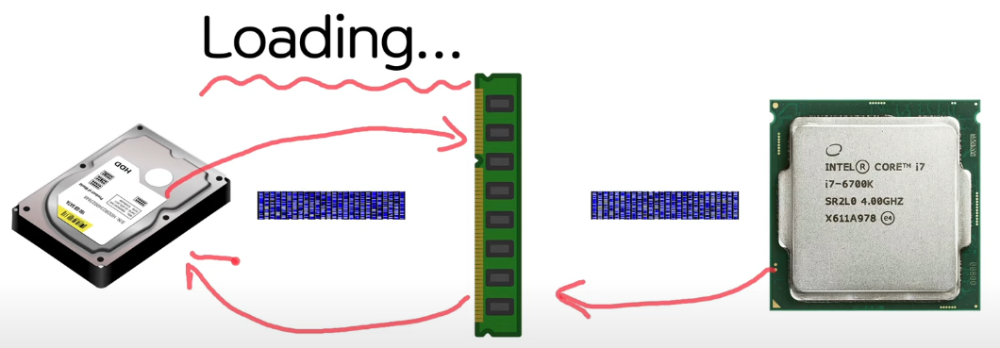

# Values & Variables

## Variables & Constants

 

> 선언방법!  
> let/var <name>: <Type> = literal_value  
> 
>
> 다음과 같이 띄어쓰기 주의할 것!  
> 

 

## Types of variables

 

## Variables and Memory(주메모리, 보조메모리)

> 변수의 life cycle
> 중괄호 : block 단위 // Stack과 관련
> Variable Scope 도 있음!
