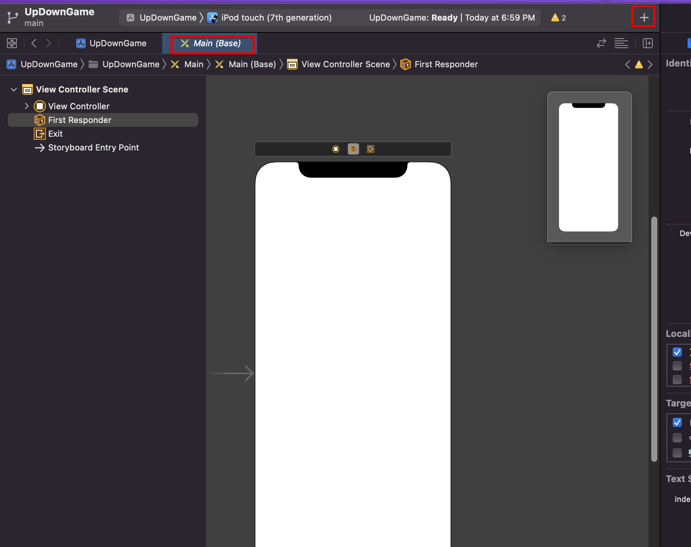

# UIKit & Storyboard

## 1. UIKit

1. 다음의 버튼으로 object 빌더 선택하여 작업

   

    

   - 버튼 클릭하여 UIKit을 화면에 배치할 수 있음(User Interface Kit)

## 2. Storyboard

1. 사용자에 보여질 화면은 미리보기
2. 화면의 어떤 컨트롤을 통해 다음 화면으로 이동할 것인지에 대한 부분도 정의(UX에 대한 설정)

   1. 인터페이스 빌더 : 스토리 + xib 파일까지 관리 가능 -> 차후에 확인해볼 것
