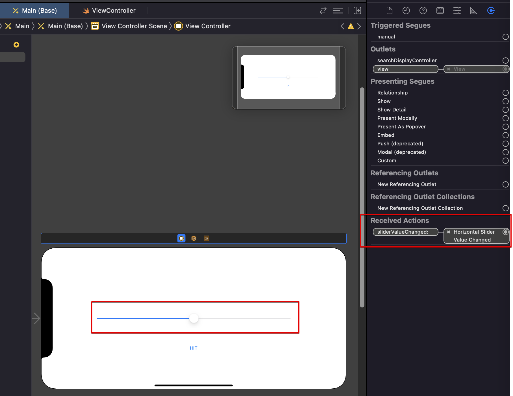

# Recieve value change from object

## 1. 개요

1. Object 스토리보드 배치
2. viewcontroller.swift 파일에 연결
   

   - 다음과 같이 코드 작성

     ```swift
         import UIKit


         class ViewController: UIViewController {

         override func viewDidLoad() {
           super.viewDidLoad()
           // Do any additional setup after loading the view.
         }

         @IBAction
           func sliderValueChanged(_ sender: UISlider){
           print(sender.value)
         }


         }

     ```
