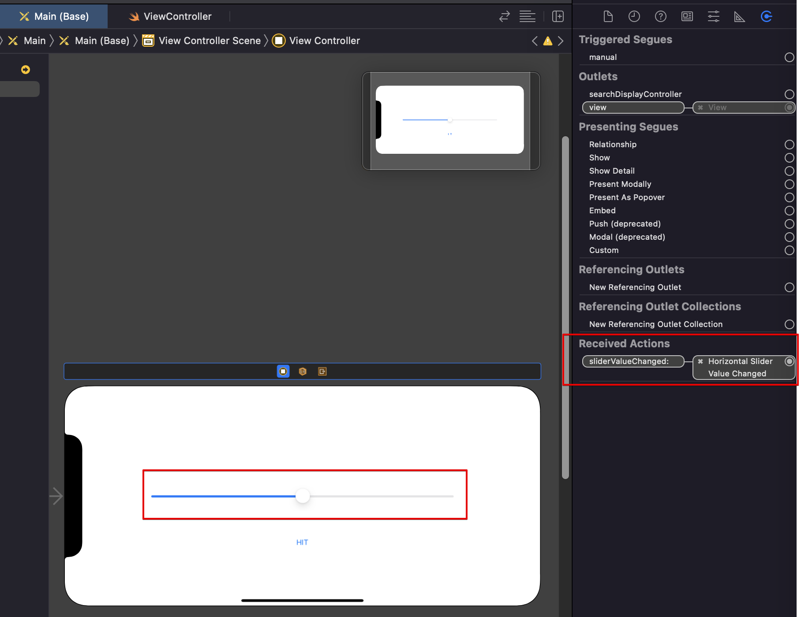

# Recieve value change from object

## 1. 개요

1. Object 스토리보드 배치
2. viewcontroller.swift 파일에 연결
   

   - 다음과 같이 코드 작성

     ```swift
         import UIKit


         class ViewController: UIViewController {

         override func viewDidLoad() {
           super.viewDidLoad()
           // Do any additional setup after loading the view.
         }

         @IBAction
           func sliderValueChanged(_ sender: UISlider){
           print(sender.value)
         }


         }

     ```

3. viewcontoller.swift에 slider와 button 연결

   1. Button에서 값을 받기 위해서, viewContoller에서 slider를 연결해주는 과정이 필요

      - 다음과 같이 코드 작성

        ```swift
          import UIKit


          class ViewController: UIViewController {


          /*
          Storyboard와 연결해주는 어노테이션 -> slider & button은 다른 sender이라 button은
          Code와 Storyboard의 연결이 필요
          slider라는 value를 사용해서 object를 코드에 받아오는 형식
          */
          @IBOutlet weak var slider: UISlider!


          override func viewDidLoad() {
          super.viewDidLoad()
          // Do any additional setup after loading the view.
          }

          @IBAction
          func sliderValueChanged(_ sender: UISlider){
              print(sender.value)
          }

          @IBAction
          func touchUpHitButton(_ sender: UIButton){
              print(slider.value)
          }

          }

        ```

   2. IB 어노테이션 기능
      1. IBAction : 인터페이스 빌더에 요소들이 이벤트를 받았을 때, 반응하는 방식을 구술하기 위해서 필요한 기능
      2. IBOutlet : 인터페이스 빌더에 올라와있는 UI 값을 가져올 때 사용
