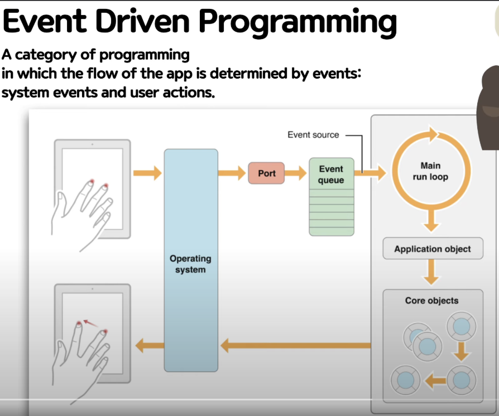

# Event Driven programming

## 1. 무엇인가?

1. 정의
   - 이벤트가 발생시, action을 취하는 방식을 결정하는 프로그래밍 방식
   - 프로그래밍의 한 종류
   - 이벤트에 대한 action을 결정하는 방식의 프로그래밍
2. 우리의 앱(Application)

   - 회색 영역
   - 동작방식 설명

     1. 반복적인 Main loop를 돌리며 이벤트를 수신받으려고 함
     2. Application object + Core object를 통해 처리
        1. Core object : 코드에 해당
     3. 사용자에게 화면 display 및 반응 제공
