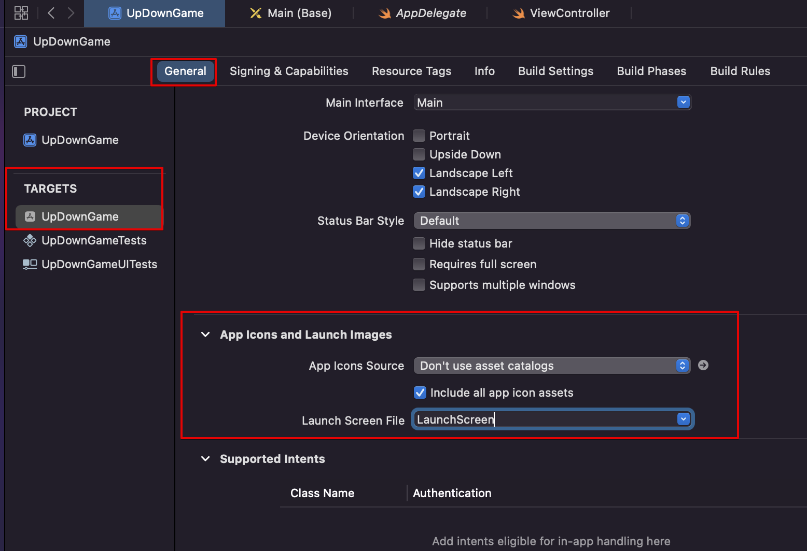
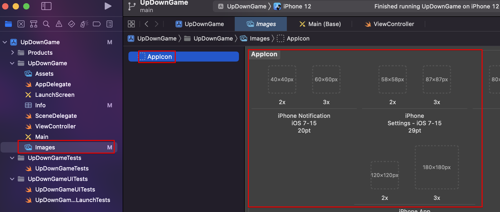
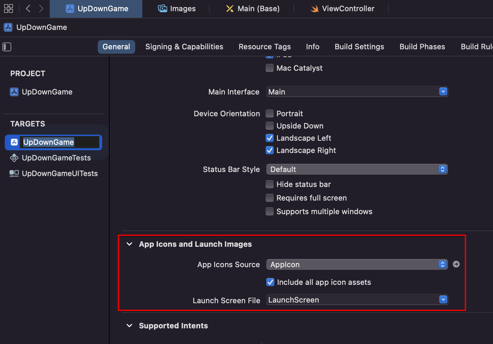
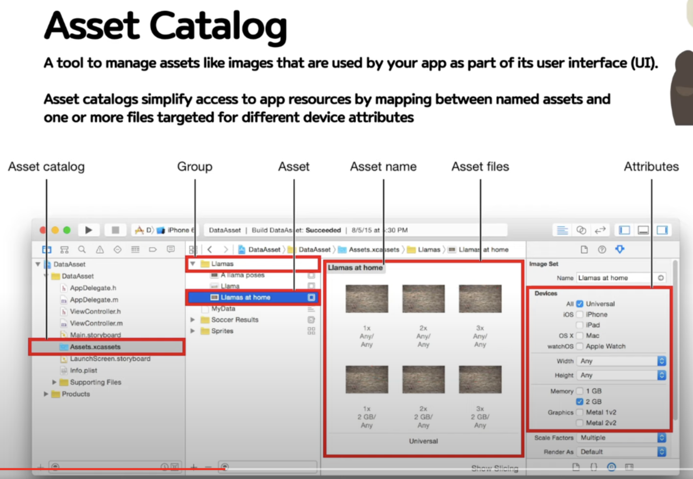

# Importing Assets

## 1) Importing Assets

## 2) App Icons catalog

- 밑의 (-) 버튼으로 app icon 삭제
- 야곰 asset.zip 에서 압축 풀고 (+) import 버튼으로 추가

## 3) App icon 다시 추가

- 새로운 asset은 asset 카탈로그에 추가해주어야 함

## 4) Asset 이란 뭔가? - 왜 사용하는가?

- Asset catalog : 여러 asset은 편리하게 관리하게 해주는 기능
- Asset 사용 이유 : `여러 기기에 대한 프로그래밍이 필요하기 때문`에, iPhone, iPad 등등에 대한 여러 이미지를 가지고 작업을 해야하기 때문

## 5) Asset types

1. app icon
2. color set
3. data set ; Sounds, docs, videos
4. image set (가장 많이 사용되는 경우)
5. color
