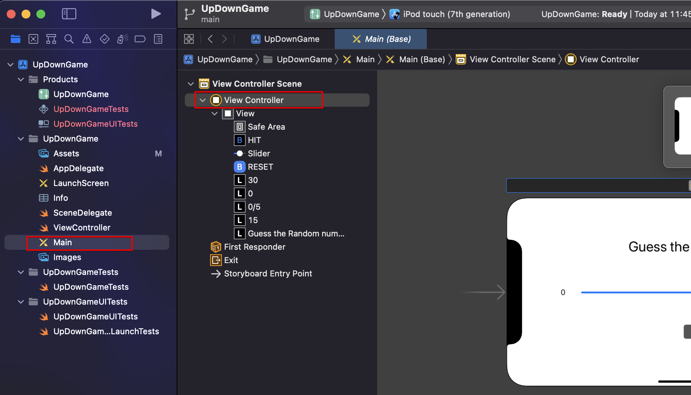
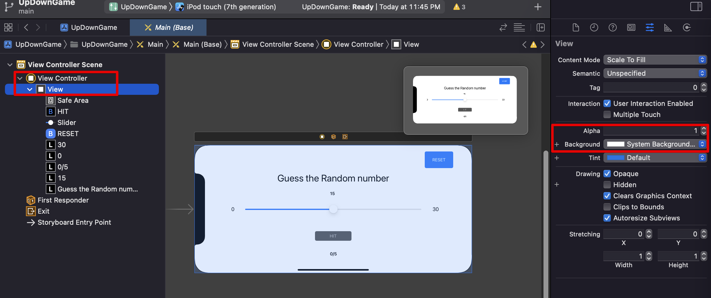

# Styling UI with personal design

## How to access

## Change app's background

## View 에서 color 바꾸기

- Attributes inspector tab
- View 항목
- color 바꿔서 확인

## Icon & Font 수정

- Attributes inspector tab
- 버튼 : image 에서 원하는 것 검색
- Label : Font 탭에서 수정
